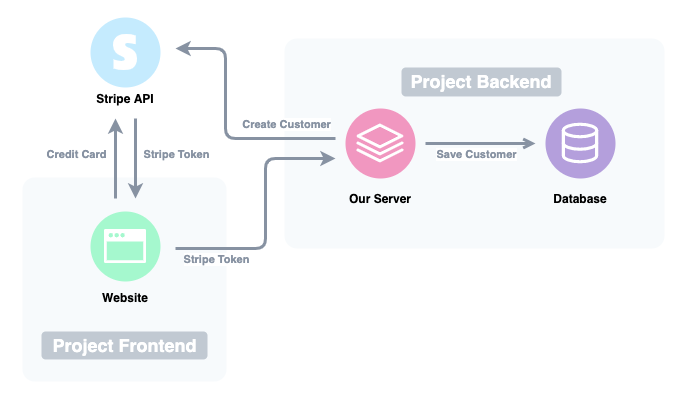

# Stripe-GraphQL Project

An implementation of Stripe subscription services via GraphQL in Typescript.

### Features

- User registration
- User login/logout
- Subscription via Stripe API
- Unsubscribe
- Update Credit Card

### Diagram

This project consists of two packages, a server and the website. When a new subscription is requested, the website passes the credit card information directly to Stripe API and receives a token which is then passed to our server. The server then creates a customer with Stripe using the user information and stores all relative information in the Postgres database.

[Learn how subscriptions work within Stripe.](https://stripe.com/docs/billing/subscriptions/overview)

### Demo

### Backend Stack

- Node JS
- Express Server
- Apollo Express Server
- TypeORM
- Postgres Database
- Stripe Node library

### Fronend Stack

- React JS
  - React Hooks
  - React Context for User management
  - Protected Routes
- Typscript
- Apollo GraphQL Client
- Stripe Client
- Bootstrap UI

### How to Start

First setup your [Stripe](https://dashboard.stripe.com/register) developer account. Create a product, you will need the price Id associated with your product.

You need the following from Stripe:

- Stripe Secret Key
- Stripe Public Key
- Stripe Price ID

Steps to run the server:

1. Run `cd server && npm i` command
2. Setup database settings inside `ormconfig.json` file
3. Add your Stripe environment variables inside the `.env` file
4. Run `npm start` command
5. Open [http://localhost:4000/graphql](http://localhost:4000/graphql) to view the GraphQL playground

Steps to run the website:

1. Run `cd web && npm i` command
2. Add your Stripe environment variables inside the `.env` file
3. Run `npm start` command
4. Open [http://localhost:3000](http://localhost:3000) to view it in the browser
